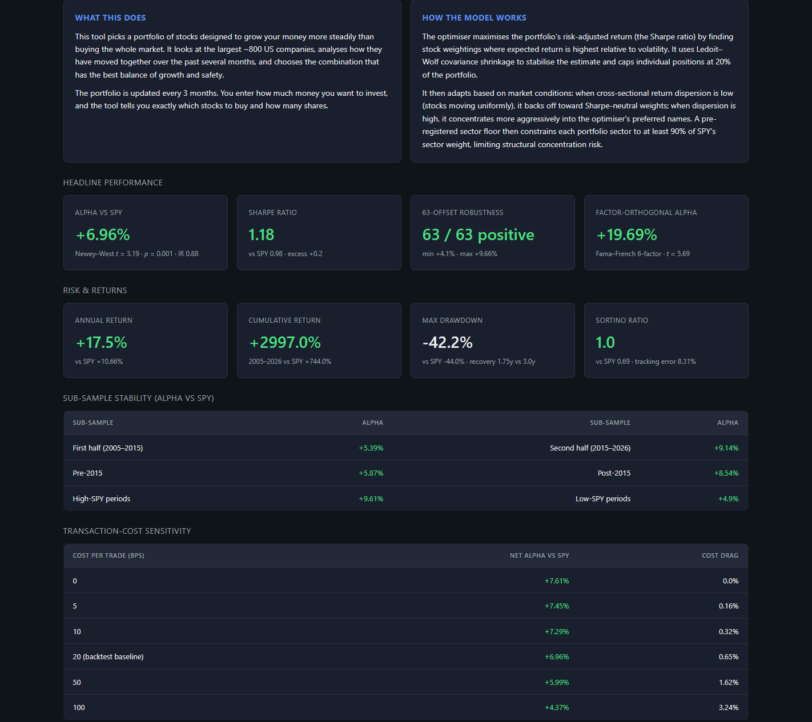
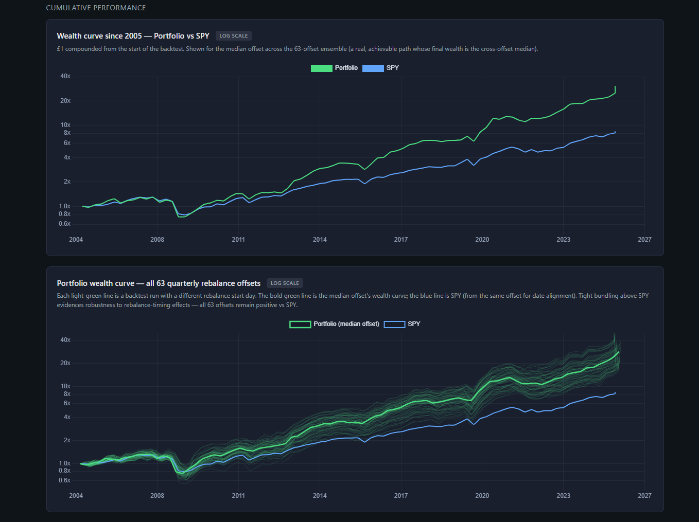

# Systematic Equity Portfolio Optimiser

An independent quantitative research project: a systematic long-only US-equity portfolio optimiser, validated with a 63-offset purged walk-forward backtest over 2005–2026 on survivorship-bias-free data.

The strategy combines a Sharpe-objective mean-variance optimiser with a dispersion-adaptive concentration mechanism and a pre-registered sector-floor risk constraint, conditioned on macro-regime signals. It produces **+6.96% annualised alpha vs SPY** that is statistically significant (Newey–West *t* = 3.19, *p* = 0.001), factor-orthogonal under Fama–French 6-factor (*α* = +19.69%, *t* = 5.69), and positive in every one of 63 tested quarterly rebalance start-days across a 21-year backtest.






---

## Headline results

Tested on the current S&P 500 + NASDAQ 100 universe using survivorship-bias-free [Norgate Data](https://norgatedata.com), with a 126-day purged training window, 21-day embargo, and quarterly rebalancing. The configuration shown is the production strategy with sector floor sf=0.90.

| Metric                              | Portfolio  | SPY       |
|-------------------------------------|-----------:|----------:|
| Annualised alpha vs SPY             | **+6.96%** | —         |
| Newey–West *t*-statistic            | **+3.19**  | —         |
| *p*-value (two-sided)               | **0.0014** | —         |
| Sharpe ratio (annualised)           | **+1.18**  | +0.98     |
| Information ratio (vs SPY)          | **+0.88**  | —         |
| Sortino ratio                       | +1.01      | +0.69     |
| Max drawdown                        | −42.2%     | −44.0%    |
| Drawdown recovery                   | 1.75y      | 3.00y     |
| Cumulative return (2005–26)         | **+2,997%**| +744%     |

## Cross-offset robustness

Each of the 63 quarterly rebalance start-days is a parallel backtest covering 2005–2026. The fact that all 63 are positive vs SPY is the central robustness claim: the strategy's edge does not depend on luck of timing.

| Across 63 rebalance offsets    |            |
|--------------------------------|-----------:|
| Mean alpha vs SPY              | +6.96%     |
| Min alpha (worst offset)       | **+4.10%** |
| Max alpha (best offset)        | +9.66%     |
| Std across offsets             | ±1.48%     |
| Offsets with positive alpha    | **63 / 63**|

## Factor attribution

The portfolio's exposures to the standard factor zoo are mostly *negative*: it tilts large-cap, growth, low-profitability, and anti-momentum. These factor headwinds reduce raw alpha, so the factor-orthogonal alpha is substantially larger than the raw figure.

| Model       | Adjusted *α* | *t*    | R²    |
|-------------|-------------:|-------:|------:|
| Raw         | +6.96%       | —      | —     |
| Fama–French 3-factor (MKT, SMB, HML)               | +15.79%      | +4.24  | 0.05  |
| Fama–French 5-factor + Momentum (FF6)              | **+19.69%**  | +5.69  | 0.27  |

The FF6 *t*-statistic of 5.69 is the strongest single significance measure in the analysis. It tells us the alpha is not explained by exposure to size, value, profitability, investment, market, or momentum — five of the six most-studied risk premia in equity research.

## Cost sensitivity

| Cost per trade (bps)   | Net alpha vs SPY |
|------------------------|-----------------:|
| 0                      | +7.61%           |
| 10                     | +7.29%           |
| 20 (backtest baseline) | +6.96%           |
| 50                     | +5.99%           |
| 100                    | +4.37%           |

Annualised turnover is 3.24×. Costs are measured round-trip (sum of buy and sell legs per turnover unit); alpha remains positive at 100bps round-trip — a stress test well above realistic execution cost for liquid US equities.

## Sub-sample stability

| Sub-sample                    | Alpha vs SPY |
|-------------------------------|-------------:|
| First half (2005–2015)        | +5.39%       |
| Second half (2015–2026)       | +9.14%       |
| Pre-2015                      | +5.87%       |
| Post-2015                     | +8.54%       |
| High-SPY periods (above median)| +9.61%      |
| Low-SPY periods (below median) | +4.90%      |

The strategy generates positive alpha in every sub-sample partition. Performance is stronger in the more recent half and in higher-SPY-return periods — worth noting honestly, because it means alpha is *not* primarily a defensive bias.

## Year-by-year

| Year | Portfolio | SPY      | Alpha vs SPY |
|------|----------:|---------:|-------------:|
| 2005 | +16.35%   | +9.68%   | +6.66%       |
| 2006 | +6.21%    | +13.24%  | −7.03%       |
| 2007 | −3.99%    | −3.32%   | −0.67%       |
| 2008 | −34.88%   | −38.38%  | +3.50%       |
| 2009 | +66.19%   | +43.82%  | +22.37%      |
| 2010 | +21.94%   | +18.58%  | +3.36%       |
| 2011 | +5.82%    | +6.31%   | −0.50%       |
| 2012 | +20.04%   | +15.39%  | +4.65%       |
| 2013 | +54.66%   | +23.57%  | +31.09%      |
| 2014 | +19.85%   | +14.66%  | +5.18%       |
| 2015 | −6.74%    | −3.07%   | −3.68%       |
| 2016 | +45.67%   | +21.70%  | +23.97%      |
| 2017 | +31.80%   | +19.32%  | +12.48%      |
| 2018 | −0.09%    | +3.30%   | −3.39%       |
| 2019 | +7.83%    | +11.90%  | −4.07%       |
| 2020 | +79.03%   | +34.75%  | +44.28%      |
| 2021 | +3.39%    | +16.21%  | −12.82%      |
| 2022 | −3.90%    | −7.76%   | +3.86%       |
| 2023 | +35.29%   | +27.86%  | +7.44%       |
| 2024 | +19.09%   | +16.88%  | +2.21%       |
| 2025 | +62.59%   | +19.06%  | +43.54%      |
| 2026* | +13.58%  | +3.31%   | +10.27%      |

*Years with positive alpha vs SPY: 15 / 22 (68%). Worst year: 2021 (−12.82%). Best year: 2020 (+44.28%). 2026 is year-to-date.*

---

## Methodology

**Universe.** Current S&P 500 + NASDAQ 100 constituents *plus* historical members that have since been delisted (~1,020 unique tickers). Survivorship bias is handled rigorously: at each rebalance date, only stocks actually in the index on that date are eligible, *including* names that have since failed (Lehman, WaMu, Ambac, First Republic, SVB, Signature).

**Training window.** 126 trading days (~6 months) of daily returns, ending **21 trading days before each rebalance date**. This 21-day embargo is a *purged walk-forward* design: it prevents leakage from short-horizon return autocorrelations — a real microstructure effect — that can inflate backtest performance without replicating out-of-sample. The methodology is standard in modern quant ML (de Prado, 2018).

**Rebalancing.** Quarterly (63 trading days). The 63-offset sweep tests the strategy across every possible rebalance start-day within a quarter, producing 63 parallel backtests. This is the key robustness test: a single-path backtest reports one schedule, lucky or unlucky; 63 offsets reveal whether the edge depends on when you happened to start.

**Optimiser.** Sharpe-objective mean-variance optimisation (scipy), with concentration controlled adaptively (parameter AS=7.0 over a 63-day dispersion lookback, median-winsorised at 15%) rather than hard weight caps.

**Sector-floor risk mechanism (pre-registered).** A soft constraint requires each GICS sector's portfolio weight to be at least 90% of its SPY weight. This was developed under a pre-registered acceptance protocol — a 4-criterion test (5% Sharpe lift, no mean-alpha damage, all-offset positivity preserved, no drawdown worsening) was specified *before* the grid was run, with thresholds locked in. sf=0.90 was selected from a {0.75, 0.90, 1.00} grid: it lifted mean alpha from +5.35% baseline to +6.96%, raised Alpha-Sharpe from 3.39 to 4.65, improved the worst-case offset by more than the mean, and reduced tracking error from 9.84% to 8.31%.

**Validation.** 63-offset out-of-sample testing across the full 2005–2026 period, no look-ahead at any stage. Confidence intervals computed two ways: (A) block bootstrap on the time-series of returns, giving sampling-uncertainty intervals; (B) cross-offset distribution, giving timing-implementation intervals. Both are reported for full transparency.

---

## Survivorship-bias correction — a research note

An earlier version of this project (v2) used a Norgate cache built by querying only the active S&P 500 and Nasdaq 100 watchlists. While developing the v2 fundamental-data extensions, I discovered the cache had silently excluded Norgate's separate **US Equities Delisted** database (~20,930 symbols), and was therefore missing every defining bank failure of 2008 — including Lehman Brothers, Washington Mutual, and Ambac Financial — plus the 2023 regional bank failures.

The v2 result (+3.85% alpha vs SPY) was retired. The cache was rebuilt querying both active and delisted databases via `index_constituent_timeseries` membership filtering, producing the present 1,020-ticker universe with all major historical failures correctly flagged. The full mechanism stack was then revalidated from scratch on the corrected data — yielding the +6.96% result documented here.

The discovery is the kind of bias that *should not exist* in a serious quant backtest but routinely does in academic and amateur work. It is the single most important data-integrity correction in the project and worth flagging explicitly.

---

## The app

The Flask application in this repository is the deployable front-end of the system:

- **Historical dashboard:** results tables and year-by-year breakdown, plus two log-scale wealth-curve charts — a canonical median-offset curve and a 63-offset fan chart.
- **Live portfolio generation:** enter a GBP value, and the app fetches current prices, runs the optimisation, and outputs a trade list with share counts, weights, and cash residuals. Supports both fractional-share and integer-only brokers with iterative cash absorption.
- **Persistence across rebalances:** save a portfolio, view it on return, commit a rebalance with a confirm-to-commit flow.

Run locally:

```bash
# Requires Python 3.10+ and Anaconda (or adjust launch.bat for system Python)
python app.py
# On Windows, simply double-click launch.bat
```

---

## Reproducing the backtest

The backtest engine itself — the optimiser, 63-offset sweep runner, sector-floor mechanism, rigorous metrics module, and feature-engineering pipeline for an in-development LightGBM extension — is kept in a private repository. This repository contains the deployable front-end plus aggregated backtest outputs sufficient to explore the results.

**If you are a prospective employer and would like access to the underlying research code for review, please reach out via LinkedIn.**

---

## Limitations and honest caveats

- **This is a backtest, not live trading.** Simulated returns. No strategy retains its backtest Sharpe in live deployment; transaction costs and market impact erode performance further than the static cost-sensitivity table suggests.
- **2005–2026 covers one major bear regime (2008).** 21 years is a small sample for tail behaviour. A prolonged bear market (1973–74, 2000–02) is not represented.
- **Index-level survivorship is still implicit.** The S&P 500 and NASDAQ 100 are themselves pre-selected for size and survival, so results do not generalise directly to the broader US equity universe.
- **Single asset class.** Long-only US equities. No shorts, no fixed income, no international, no commodities.
- **2021 was the worst year (−12.82% vs SPY).** Honestly, this was a year of unusual mega-cap concentration where the strategy's sector diversification was a drag. It is documented year-by-year and not smoothed over.

---

## Future work

- **Fundamental-data integration** (earnings, book value, cash flow) as first-class features.
- **Cross-sectional LightGBM ranking model** integrating engineered technical and macroeconomic features.
- **v2 architecture** incorporating Black–Litterman-style view integration, allowing calibrated confidence in fundamental vs technical signals.
- **International developed-market extension.**

---

## About

An independent quantitative research project by **Findlay Roberts**. BSc Economics, London School of Economics (2021). Built from scratch in Python — numpy, pandas, scipy, scikit-learn, LightGBM, Flask.

Contact via [LinkedIn](https://www.linkedin.com/in/findlay-roberts-701502216).
