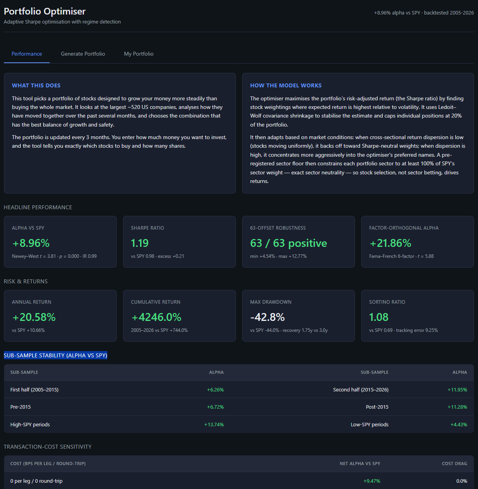
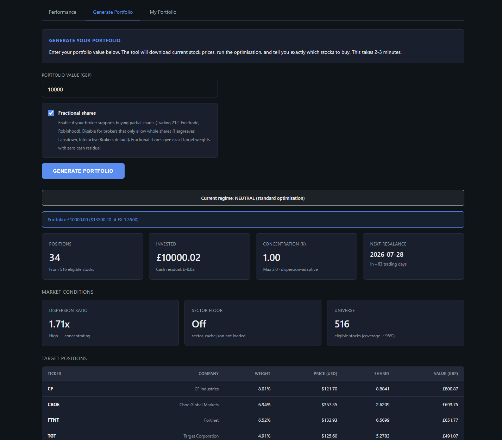

# Systematic Equity Portfolio Optimiser

An independent quantitative research project: a systematic long-only US-equity portfolio optimiser, validated with a 63-offset purged walk-forward backtest over 2005–2026 on survivorship-bias-free data.

The strategy combines a Sharpe-objective mean-variance optimiser with a dispersion-adaptive concentration mechanism, a cross-sectional LightGBM ranking signal applied as a post-optimisation weight tilt, and an exact sector-neutrality constraint. It produces **+8.96% annualised alpha vs SPY** that is statistically significant (Newey–West *t* = 3.81, *p* = 0.0001), factor-orthogonal under Fama–French 6-factor (*α* = +21.86%, *t* = 5.88), and positive in every one of 63 tested quarterly rebalance start-days across a 21-year backtest.






---

## Headline results

Tested on the current S&P 500 + NASDAQ 100 universe using survivorship-bias-free [Norgate Data](https://norgatedata.com), with a 126-day purged training window, 21-day embargo, and quarterly rebalancing. The configuration shown is the production strategy: conservative tilt λ=0.75, sector floor sf=1.00 (exact sector-neutrality).

| Metric                              | Portfolio   | SPY       |
|-------------------------------------|------------:|----------:|
| Annualised alpha vs SPY             | **+8.96%**  | —         |
| Newey–West *t*-statistic            | **+3.814**  | —         |
| *p*-value (two-sided)               | **0.0001**  | —         |
| Portfolio raw return (annualised)   | +20.58%     | —         |
| Sharpe ratio (annualised)           | **+1.186**  | +0.978    |
| Information ratio (vs SPY)          | **+0.988**  | —         |
| Tracking error                      | 9.25%       | —         |
| Sortino ratio                       | +1.077      | +0.686    |
| Max drawdown                        | −42.81%     | −43.97%   |
| Drawdown recovery                   | 1.75y       | 3.00y     |
| Cumulative return, median-offset path | **40.72× (+3,972%)** | 7.87× (+687%) |

**On the cumulative row.** Both figures are the **median-offset path (offset 49)** — a single, actually-achievable rebalance schedule, not an average across schedules. Portfolio and SPY are read from the same offset, so they cover the same window. On that path the portfolio compounded to roughly **5.2× SPY's terminal wealth**, which is the internally consistent comparison and the honest headline.

One caveat worth pre-empting: the median offset differs between runs — it was offset 25 previously and is offset 49 now — so the two runs begin on different dates (2005-03-15 now, 2005-02-08 before). That six-week shift is why the SPY leg reads +687% here against +744% in the previous version. SPY did not perform worse; it is a different starting point on the same index. **The SPY leg is therefore not directly comparable across versions of this README, and the old +2,997% vs +744% pair should not be set against the new +3,972% vs +687% pair as though they covered identical windows.** Within a single run, the portfolio-vs-SPY comparison is exact.

Interval estimates are computed two ways and both are reported. Block-bootstrap on the return time series gives an alpha point estimate of **+9.14%**, 95% CI **[+4.50%, +14.18%]**, and a portfolio raw return of +20.58%, 95% CI [+10.89%, +29.96%]. The cross-offset distribution — a different question, about implementation timing rather than sampling — is given in the next-but-one section.

Distributional detail: mean alpha per rebalance period +2.284% (Newey–West SE, lag 3, of 0.5989%); CVaR at 5% of −14.70% per period; skew −0.433; excess kurtosis +4.016. The alpha stream itself has a maximum drawdown of −10.14% with a 1.25-year recovery.

### What changed from the previous version, honestly

The previous published result was +6.96% alpha. The improvement is real but it is **specifically an improvement in benchmark-relative delivery, not in standalone risk-adjusted return**:

- **Alpha rose ~2 points**, +6.96% → +8.96%.
- **Information ratio rose meaningfully**, +0.88 → +0.99. This is the metric that actually improved.
- **Sharpe barely moved**, +1.18 → +1.186. Standalone risk-adjusted return is essentially unchanged.
- **Max drawdown got slightly worse**, −42.2% → −42.81%.

So the honest summary is that the strategy now extracts more alpha per unit of tracking error against its benchmark, while its own risk-return profile is roughly where it was. Anyone reading a rising alpha number as a uniform improvement would be reading it wrong.

## Ex-2020 robustness

2020 is the single largest contributor to the headline result (+104.24% portfolio return, +69.49% alpha in that year alone). The obvious question is whether the strategy is one good year wearing a trenchcoat. It is not.

Re-running the identical production configuration with every 2020 period-observation removed — dropping 253 of 5,304 observations, leaving 5,051 across 63 offsets × 81 periods:

| Metric (2020 excluded)         | Value                   |
|--------------------------------|------------------------:|
| Annualised alpha vs SPY        | **+6.98%**              |
| Newey–West *t*-statistic       | **+3.519**              |
| *p*-value                      | **0.0004**              |
| Mean alpha per period          | +1.800% (NW SE 0.5114%) |
| Bootstrap alpha, 95% CI        | +7.20% [+2.91%, +10.71%]|
| Portfolio raw return, 95% CI   | +17.78% [+8.62%, +25.46%]|
| Cross-offset mean (std)        | +6.98% (±1.63%)         |
| Cross-offset min / max         | +3.55% / +10.64%        |
| Offsets with positive alpha    | **63 / 63**             |
| Sharpe ratio                   | **+1.137**              |

**Excluding its single best year, the strategy still produces +6.98% alpha, still significant at *t* = 3.52, with all 63 rebalance offsets still positive.** That is the strategy surviving its own worst-case stress test, and it is arguably a more informative number than the headline.

*Not computed ex-2020:* information ratio, Sortino, drawdown, tracking error, factor attribution, and the year-by-year decomposition. Those figures exist only for the full-sample run and are not reproduced here for the ex-2020 case. Cumulative returns were likewise not recomputed on the ex-2020 basis.

## Cross-offset robustness

Each of the 63 quarterly rebalance start-days is a parallel backtest covering 2005–2026. The fact that all 63 are positive vs SPY is the central robustness claim: the strategy's edge does not depend on luck of timing.

| Across 63 rebalance offsets (85 periods, 5,304 observations) |             |
|--------------------------------------------------------------|------------:|
| Mean alpha vs SPY                                            | +8.96%      |
| Std across offsets                                           | ±1.77%      |
| Min alpha (worst offset)                                     | **+4.54%**  |
| Max alpha (best offset)                                      | +12.77%     |
| 95% empirical band                                           | [+5.42%, +12.36%] |
| Offsets with positive alpha                                  | **63 / 63** |

Sharpe has two corresponding intervals depending on which uncertainty you are asking about: the time-series bootstrap gives [+0.579, +1.997], the cross-offset distribution gives [+0.756, +1.072]. The cross-offset band is much tighter, which is the point — timing choice matters far less than sampling variation.

Cumulative wealth across offsets: portfolio mean +4,245.8% (min +1,498.2%, max +8,789.0%) against SPY's +743.5%, with cumulative alpha positive for every offset. *These are cross-offset mean statistics, not a single achievable path — see the note on the headline cumulative figure above.*

## Factor attribution

The portfolio's exposures to the standard factor zoo are mostly *negative*: it tilts large-cap, growth, low-profitability, and strongly anti-momentum. These factor headwinds reduce raw alpha, so the factor-orthogonal alpha is substantially larger than the raw figure.

| Model                                 | Adjusted *α* | *t*    | R²    | Adj. R² |
|---------------------------------------|-------------:|-------:|------:|--------:|
| Raw                                   | +8.96%       | —      | —     | —       |
| Fama–French 3-factor (MKT, SMB, HML)  | +17.77%      | +4.42  | 0.071 | 0.037   |
| Fama–French 5-factor + Momentum (FF6) | **+21.86%**  | +5.88  | 0.296 | 0.242   |

Factor loadings (FF6): MKT −0.074 (*t* −0.59), SMB −0.545 (*t* −2.28), HML −0.413 (*t* −2.20), RMW −0.533 (*t* −2.08), CMA −0.068 (*t* −0.22), MOM −0.578 (*t* −4.43).
Factor loadings (FF3): MKT +0.080 (*t* 0.58), SMB −0.133 (*t* −0.51), HML −0.386 (*t* −2.44).

The FF6 *t*-statistic of 5.88 is the strongest single significance measure in the analysis. It tells us the alpha is not explained by exposure to size, value, profitability, investment, market, or momentum — five of the six most-studied risk premia in equity research. The large negative momentum loading is worth noting: the strategy is structurally *anti*-momentum, and is generating alpha despite that, not because of it.

## Cost sensitivity

**Cost convention.** Figures below are quoted in **basis points per leg** (per trade), with the round-trip equivalent shown alongside. The backtest baseline is **10bps per leg = 20bps round-trip**.

*This convention has not changed.* Earlier versions of this README tabulated the same 20bps round-trip assumption under a column header reading "cost per trade", which was a labelling error — the header said per-leg while the numbers were round-trip. The underlying cost assumption is, and always was, 10bps per leg / 20bps round-trip. Only the label is corrected.

| Cost (bps per leg) | Round-trip (bps) | Net alpha vs SPY |
|--------------------|-----------------:|-----------------:|
| 0                  | 0                | +9.47%           |
| 5                  | 10               | +9.30%           |
| **10 (baseline)**  | **20**           | **+9.14%**       |
| 20                 | 40               | +8.81%           |
| 50                 | 100              | +7.83%           |
| 100                | 200              | +6.19%           |

Annualised turnover is 3.28× (average 0.820 per rebalance period). Alpha remains positive at 100bps per leg / 200bps round-trip — a stress test far above realistic execution cost for liquid US equities.

## Sub-sample stability

| Sub-sample                     | Alpha vs SPY |
|--------------------------------|-------------:|
| First half (2005–2015)         | +6.26%       |
| Second half (2015–2026)        | +11.95%      |
| Pre-2015                       | +6.72%       |
| Post-2015                      | +11.28%      |
| High-SPY periods (above median)| +13.74%      |
| Low-SPY periods (below median) | +4.43%       |

The strategy generates positive alpha in every sub-sample partition. Performance is stronger in the more recent half and markedly stronger in higher-SPY-return periods — worth stating plainly, because it means the alpha is *not* a defensive bias. This strategy does not protect you in falling markets; it outperforms most in rising ones.

## Year-by-year

| Year  | Portfolio | Equal-Weight | SPY      | α vs EW  | α vs SPY |
|-------|----------:|-------------:|---------:|---------:|---------:|
| 2005  | +15.63%   | +15.43%      | +9.68%   | +0.20%   | +5.95%   |
| 2006  | +6.20%    | +14.89%      | +13.24%  | −8.69%   | −7.04%   |
| 2007  | −3.66%    | −6.90%       | −3.32%   | +3.24%   | −0.34%   |
| 2008  | −35.52%   | −38.16%      | −38.38%  | +2.64%   | +2.86%   |
| 2009  | +69.78%   | +74.14%      | +43.82%  | −4.36%   | +25.96%  |
| 2010  | +21.63%   | +24.78%      | +18.58%  | −3.16%   | +3.04%   |
| 2011  | +6.57%    | +5.11%       | +6.31%   | +1.46%   | +0.25%   |
| 2012  | +20.54%   | +17.08%      | +15.39%  | +3.46%   | +5.15%   |
| 2013  | +58.30%   | +27.19%      | +23.57%  | +31.11%  | +34.72%  |
| 2014  | +23.91%   | +15.08%      | +14.66%  | +8.83%   | +9.25%   |
| 2015  | −3.54%    | −6.40%       | −3.07%   | +2.86%   | −0.48%   |
| 2016  | +46.90%   | +24.75%      | +21.70%  | +22.16%  | +25.21%  |
| 2017  | +37.97%   | +15.89%      | +19.32%  | +22.08%  | +18.64%  |
| 2018  | +6.57%    | +2.71%       | +3.30%   | +3.86%   | +3.26%   |
| 2019  | +8.27%    | +5.06%       | +11.90%  | +3.20%   | −3.63%   |
| 2020  | +104.24%  | +43.93%      | +34.75%  | +60.31%  | +69.49%  |
| 2021  | +6.12%    | +15.23%      | +16.21%  | −9.11%   | −10.09%  |
| 2022  | −4.91%    | −3.27%       | −7.76%   | −1.64%   | +2.85%   |
| 2023  | +56.12%   | +14.92%      | +27.86%  | +41.20%  | +28.26%  |
| 2024  | +9.97%    | +11.11%      | +16.88%  | −1.14%   | −6.90%   |
| 2025  | +50.35%   | +14.75%      | +19.06%  | +35.59%  | +31.29%  |
| 2026* | +10.19%   | +1.71%       | +3.31%   | +8.48%   | +6.88%   |

*Years with positive alpha vs SPY: 16 / 22 (73%). Versus equal-weight: 16 / 22. Worst year: 2021 (−10.09% vs SPY). Best year: 2020 (+69.49%). 2026 is year-to-date.*

## Documented secondary variant (aggressive tilt, λ=1.35)

The tilt strength λ trades alpha against tracking error. The production configuration uses the conservative λ=0.75. A more aggressive λ=1.35 setting, with the same sf=1.0 sector neutrality, is documented here for completeness — it is **not** the production strategy.

| Metric                    | λ=0.75 (production) | λ=1.35 (aggressive) |
|---------------------------|--------------------:|--------------------:|
| Alpha vs SPY              | +8.96%              | +10.94%             |
| Newey–West *t* (*p*)      | +3.814 (0.0001)     | +3.629 (0.0003)     |
| Sharpe                    | +1.186              | +1.172              |
| Information ratio         | +0.988              | +0.959              |
| Tracking error            | 9.25%               | 11.53%              |
| Max drawdown              | −42.81%             | −42.81%             |
| Annualised turnover       | 3.28×               | 3.33×               |
| FF3 α (*t*)               | +17.77% (4.42)      | +19.69% (4.43)      |
| FF6 α (*t*)               | +21.86% (5.88)      | +23.63% (5.61)      |
| Years positive vs SPY     | 16 / 22             | 17 / 22             |
| Best / worst year         | +69.49% / −10.09%   | +107.55% / −13.08%  |
| Cross-offset mean (std)   | +8.96% (±1.77%)     | +10.94% (±2.52%)    |
| Cross-offset min / max    | +4.54% / +12.77%    | +4.46% / +15.54%    |
| All 63 offsets positive   | Yes                 | Yes                 |

The aggressive variant buys ~2 points of additional alpha with 2.3 points of extra tracking error, a *lower* information ratio, a wider cross-offset spread and a worse worst year. λ=0.75 is the production choice because it delivers more alpha per unit of benchmark-relative risk, which is the quantity that actually matters to an allocator.

---

## Methodology

**Universe.** Current S&P 500 + NASDAQ 100 constituents *plus* historical members that have since been delisted (~1,020 unique tickers). Survivorship bias is handled rigorously: at each rebalance date, only stocks actually in the index on that date are eligible, *including* names that have since failed (Lehman, WaMu, Ambac, First Republic, SVB, Signature).

**Training window.** 126 trading days (~6 months) of daily returns, ending **21 trading days before each rebalance date**. This 21-day embargo is a *purged walk-forward* design: it prevents leakage from short-horizon return autocorrelations — a real microstructure effect — that can inflate backtest performance without replicating out-of-sample. The methodology is standard in modern quant ML (de Prado, 2018).

**Rebalancing.** Quarterly (63 trading days). The 63-offset sweep tests the strategy across every possible rebalance start-day within a quarter, producing 63 parallel backtests. This is the key robustness test: a single-path backtest reports one schedule, lucky or unlucky; 63 offsets reveal whether the edge depends on when you happened to start.

**Optimiser.** Sharpe-objective mean-variance optimisation (scipy) with Ledoit–Wolf covariance shrinkage, concentration controlled adaptively (parameter AS=7.0 over a 63-day dispersion lookback, median-winsorised at 15%) rather than by hard weight caps alone, with a 20% per-position cap as a backstop.

**Cross-sectional LightGBM signal, transmitted as a weight tilt.** A LightGBM ranking model scores the eligible universe cross-sectionally at each rebalance from a **locked eight-feature set**. The critical design decision is *how* that score reaches the portfolio. The score is applied as a **gentle post-optimisation weight tilt** (strength λ=0.75) — the optimiser solves first, and the ML score then nudges the resulting weights.

The alternative and more obvious approach — injecting the score into the expected-return vector μ before optimisation — was tried and **failed**. The reason is instructive: mean-variance optimisation is notoriously sensitive to errors in μ, and an ML score is a noisy ranking, not a calibrated return forecast. Feeding it into μ lets the optimiser lever up on estimation noise, and the resulting portfolios were unstable. Applying the same information as a bounded post-optimisation tilt caps how much damage a wrong score can do while retaining the ranking information. Same signal, same features — the transmission mechanism is what made it work.

**Sector-floor risk mechanism (pre-registered).** A soft constraint requires each GICS sector's portfolio weight to be at least sf × its SPY weight. The production setting is **sf = 1.00 — exact sector-neutrality**.

This was developed under a pre-registered acceptance protocol: a 4-criterion test (5% Sharpe lift, no mean-alpha damage, all-offset positivity preserved, no drawdown worsening) was specified *before* the grid was run, with thresholds locked in. Across the {0.75, 0.90, 1.00} grid, sector de-concentration improved risk-adjusted return **monotonically** — there was no interior peak. sf=1.00 therefore sits in a robust plateau rather than at a fitted optimum, which matters: a parameter selected at the edge of a monotone region is far less likely to be an artefact of the sample than one selected at a hump in the middle of a grid.

sf=1.00 also has an *a priori* justification independent of the backtest, which is the stronger argument. Exact sector-neutrality is a principled choice, not a tuned one: it says the model is not paid to bet on sectors, only to select stocks within them. **Sector belongs in the signal, not in the portfolio** — sector information is available to the LightGBM ranker as a feature, where it can inform stock selection, while the portfolio itself carries no residual sector bet. This supersedes the earlier sf=0.90 production choice.

**Validation.** 63-offset out-of-sample testing across the full 2005–2026 period, no look-ahead at any stage. Confidence intervals computed two ways: (A) block bootstrap on the time-series of returns, giving sampling-uncertainty intervals; (B) cross-offset distribution, giving timing-implementation intervals. Both are reported for full transparency.

---

## Survivorship-bias correction — a research note

An earlier version of this project (v2) used a Norgate cache built by querying only the active S&P 500 and Nasdaq 100 watchlists. While developing the v2 fundamental-data extensions, I discovered the cache had silently excluded Norgate's separate **US Equities Delisted** database (~20,930 symbols), and was therefore missing every defining bank failure of 2008 — including Lehman Brothers, Washington Mutual, and Ambac Financial — plus the 2023 regional bank failures.

The v2 result (+3.85% alpha vs SPY) was retired. The cache was rebuilt querying both active and delisted databases via `index_constituent_timeseries` membership filtering, producing the present 1,020-ticker universe with all major historical failures correctly flagged. The full mechanism stack was then revalidated from scratch on the corrected data — and every result documented here, including the +8.96% headline, is computed on that corrected universe.

The discovery is the kind of bias that *should not exist* in a serious quant backtest but routinely does in academic and amateur work. It is the single most important data-integrity correction in the project and worth flagging explicitly.

---

## The app

The Flask application in this repository is the deployable front-end of the system:

- **Historical dashboard:** results tables and year-by-year breakdown, plus two log-scale wealth-curve charts — a canonical median-offset curve and a 63-offset fan chart.
- **Live portfolio generation:** enter a GBP value, and the app fetches current prices, runs the optimisation, and outputs a trade list with share counts, weights, and cash residuals. Supports both fractional-share and integer-only brokers with iterative cash absorption.
- **Persistence across rebalances:** save a portfolio, view it on return, commit a rebalance with a confirm-to-commit flow.

Run locally:

```bash
# Requires Python 3.10+ and Anaconda (or adjust launch.bat for system Python)
python app.py
# On Windows, simply double-click launch.bat
```

The dashboard reads `primary.json` and `charts.json`. These are committed alongside `app.py`, so a fresh clone renders the dashboard immediately; if a local research export exists at `~/.norgate_dashboard/`, that takes precedence.

---

## Reproducing the backtest

The backtest engine itself — the optimiser, 63-offset sweep runner, sector-floor mechanism, rigorous metrics module, and the LightGBM feature-engineering and ranking pipeline — is kept in a private repository. This repository contains the deployable front-end plus aggregated backtest outputs sufficient to explore the results.

**If you are a prospective employer and would like access to the underlying research code for review, please reach out via LinkedIn.**

---

## Limitations and honest caveats

- **This is a backtest, not live trading.** Simulated returns. No strategy retains its backtest Sharpe in live deployment; transaction costs and market impact erode performance further than the static cost-sensitivity table suggests.
- **The result is materially dependent on 2020.** 2020 alone contributed +69.49% alpha against a full-period mean of +8.96%, and removing it takes the headline from +8.96% to +6.98% — roughly two points, or about 22% of the total. The ex-2020 result remains significant (*t* = 3.52) with all 63 offsets positive, which is why it is presented as a headline robustness check rather than buried here. But a reader should understand that roughly a fifth of the reported edge comes from a single extraordinary year, and that the ex-2020 decomposition does not extend to IR, Sortino, drawdown or factor attribution, which have not been recomputed on that basis.
- **Alpha is concentrated in rising markets.** High-SPY periods produce +13.74% alpha versus +4.43% in low-SPY periods. This is not a hedge.
- **2005–2026 covers one major bear regime (2008).** 21 years is a small sample for tail behaviour. A prolonged bear market (1973–74, 2000–02) is not represented.
- **Index-level survivorship is still implicit.** The S&P 500 and NASDAQ 100 are themselves pre-selected for size and survival, so results do not generalise directly to the broader US equity universe.
- **Single asset class.** Long-only US equities. No shorts, no fixed income, no international, no commodities.
- **2021 was the worst year (−10.09% vs SPY).** A year of unusual mega-cap concentration where the strategy's sector neutrality was a drag. It is documented year-by-year and not smoothed over.
- **Sharpe did not improve.** The move from +6.96% to +8.96% alpha raised the information ratio (+0.88 → +0.99) but left Sharpe essentially flat (+1.18 → +1.186) and drawdown marginally worse (−42.2% → −42.81%). The gain is in benchmark-relative efficiency, not standalone risk-adjusted return.

---

## Future work

- **Fundamental-data integration** (earnings, book value, cash flow) as first-class features alongside the existing technical and macro feature set.
- **Ex-2020 extension of the full metric suite** — IR, Sortino, drawdown and factor attribution on the 2020-excluded sample.
- **v2 architecture** incorporating Black–Litterman-style view integration, allowing calibrated confidence in fundamental vs technical signals — a more principled route to the same problem the weight tilt currently solves heuristically.
- **International developed-market extension.**

---

## About

An independent quantitative research project by **Findlay Roberts**. BSc Economics, London School of Economics (2021). Built from scratch in Python — numpy, pandas, scipy, scikit-learn, LightGBM, Flask.

Contact via [LinkedIn](https://www.linkedin.com/in/findlay-roberts-701502216).
